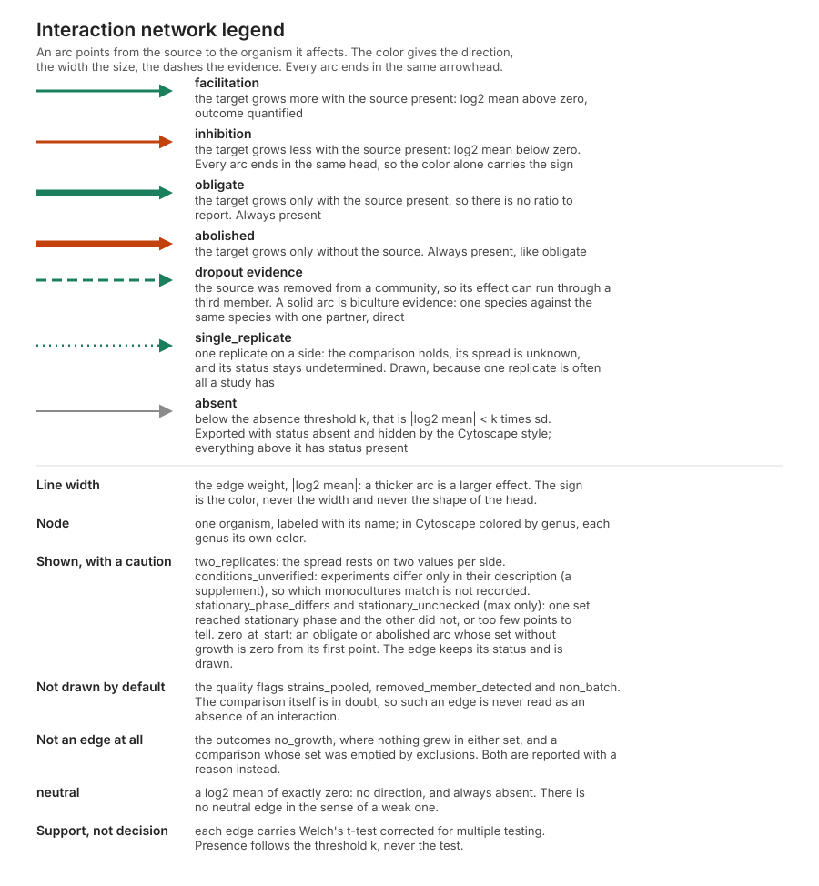

# grownet: growth-curve derived interaction networks

[](https://github.com/crossfeed-bio/crossfeed/actions/workflows/ci.yml)
[](LICENSE)
[](pyproject.toml)

grow**net** turns experimentally grounded microbial co-growth data from
[mGrowthDB](https://mgrowthdb.gbiomed.kuleuven.be/) into directed interaction networks, in a neutral and
openly citable format that downstream tools (such as Syntropa and microbetag) can consume.

grow**net** was called crossfeed until 2026-09-27 (#71). The package, the module and the command are
`grownet`; the repository keeps the old name for now, so its address is still `crossfeed-bio/crossfeed`.

It is a thin client: it pulls from mGrowthDB and emits a network. Nothing to host, nothing to pay for on a
shared server, no runtime dependencies (the client is pure Python standard library). A well-run
repository, one per contributor, is all it needs.

This README is the full guide: install and run it, read and validate the output format, and plug in your
own derivation method. Nothing here needs another document to follow.

## Contents

- [Install](#install)
- [Quickstart](#quickstart)
- [What it does](#what-it-does)
- [The command line](#the-command-line)
- [The legend](#the-legend)
- [The local page](#the-local-page)
- [Send it to Cytoscape](#send-it-to-cytoscape)
- [Simulate it in R](#simulate-it-in-r)
- [The output format](#the-output-format)
- [Plug in your own method](#plug-in-your-own-method)
- [How the derivation works](#how-the-derivation-works)
- [Guardrails](#guardrails)
- [Attribution and data governance](#attribution-and-data-governance)
- [License](#license)

## Install

Three ways, from the least to the most technical. All give the same program.

### Windows, without installing anything

From the first release on, each [release](https://github.com/crossfeed-bio/crossfeed/releases) carries
`grownet-<version>-windows.zip`: the whole program in one folder, Python included. Unzip it (right-click,
Extract All), open the folder and double-click `grownet.exe`. A black window opens and shows an address, and
your browser opens the page there; closing the black window stops the program.

Windows warns about any new program it has not seen many people run, so the first time it says "Windows
protected your PC". Click the small "More info" link under the message; only then does a "Run anyway"
button appear, and clicking it starts grownet. That is Windows being cautious about an unfamiliar
program, not a finding about this one, which is built in public by this repository's automated build. On
Windows 11 with Smart App Control on, Windows may block it instead; then use one of the two routes below.
The zip's `README.txt` says the same, for whoever unzips it.

### With uv (macOS, Linux and Windows)

The quickest route is [uv](https://docs.astral.sh/uv/), which fetches a suitable Python by itself. The
Python that ships with macOS (3.9) is too old for grow**net**, and uv avoids that. Install uv once:

```bash
curl -LsSf https://astral.sh/uv/install.sh | sh
```

(On Windows, use the PowerShell command on [uv's site](https://docs.astral.sh/uv/getting-started/installation/).)
Then open the local page (the first run installs it; later runs start at once):

```bash
uvx --from git+https://github.com/crossfeed-bio/crossfeed grownet gui
```

Any `grownet` command works the same way, for example
`uvx --from git+https://github.com/crossfeed-bio/crossfeed grownet derive SMGDB00000004 --live`.
This always runs the latest version in the repository.

### From PyPI

Since the first release (0.1.0), the program is on
[PyPI](https://pypi.org/project/grownet/), so it installs like any other Python tool, as a command of its
own:

```bash
uv tool install grownet        # or: pipx install grownet
grownet gui
```

`uv tool upgrade grownet` (or `pipx upgrade grownet`) moves to a new release. With Python 3.10 or newer
already installed and neither uv nor pipx, `python3 -m pip install --user grownet` works too (on Windows,
`py -m pip install --user grownet`). Use one of these routes, not several: each writes its own `grownet`
command, and they collide. If pipx says "File exists at ~/.local/bin/grownet ... Not modifying", an earlier
`pip install --user` (for example from the repository, before 0.1.0) still owns the command; remove it
with `python3 -m pip uninstall grownet`, then run `pipx install --force grownet` (found by Karoline).

### To develop it

From a clone, with Python 3.10 or newer: the setup and the checks are in
[CONTRIBUTING.md](CONTRIBUTING.md#development-setup), and how a release is made in
[RELEASING.md](RELEASING.md).

## Quickstart

From a clone of the repository, run it offline first, from the synthetic fixture in
`tests/fixtures` (no network), to see a network. The fixture is part of the repository, not of an
installed grow**net**, so after an install use the live commands below instead.

```
python -m grownet derive SMGDB00000004 --fixture tests/fixtures/example_interactions.json
```

Run it live against mGrowthDB:

```
python -m grownet derive SMGDB00000004 --live
```

On the published study SMGDB00000004 the default derivation recovers Blautia hydrogenotrophica
facilitating Faecalibacterium prausnitzii, consistent with hydrogen and formate cross-feeding. Write the
result to a file and check it against the format:

```
python -m grownet derive SMGDB00000004 --live --out network.json
python -m grownet validate network.json
```

## What it does

Given a set of query organisms, grow**net** builds an interaction network on the fly from mGrowthDB
co-growth measurements. Each edge is a directed interaction, facilitation or inhibition, with its
strength, the evidence behind it (p-value, q-value, significance) and the condition and `medium` it holds
in. An edge is specific to that condition: comparisons never mix media. Every edge carries its
provenance, the study or studies it was derived from, so attribution resolves at the edge level.

A network can leave in several shapes: the neutral JSON, GraphML for Cytoscape and friends, the adjacency
matrix, and the parameters of a generalized Lotka-Volterra simulation, which the companion R package
receives over a local port.

The pipeline has three seams: a client that pulls raw growth from mGrowthDB (`grownet.mgrowthdb`), a
derivation step that turns growth into interaction records (`grownet.derive`, the part you would
replace), and the neutral network model the records map into (`grownet.model`). The Faecalibacterium
prausnitzii and Blautia hydrogenotrophica pair, shown feeding Syntropa, is the worked example of that
seam.

## The command line

```
python -m grownet derive STUDY [--live | --fixture FILE] [--deriver MODULE:CLASS] [--format json|graphml|matrix] [--out FILE]
python -m grownet derive --live --species NAME [NAME ...] [--all-partners] [STUDY,STUDY] [--out FILE] [--report FILE] [--to-cytoscape]
python -m grownet derive --live --all [STUDY,STUDY] [--out FILE] [--report FILE] [--to-cytoscape]
python -m grownet validate FILE
python -m grownet schema [--out FILE]
```

- `derive STUDY --live` fetches the study from the mGrowthDB API and derives interactions.
- `derive --live --species NAME ...` does what the local page does: resolves species or strain names (or
  NCBI taxon ids) through mGrowthDB, derives every study holding them, and keeps the interactions between
  the species given (`--all-partners` keeps their other partners too). A genus alone ("Blautia") stands
  for every species of it that mGrowthDB holds. The page's Example, from the command line:
  `grownet derive --live --species "Faecalibacterium duncaniae" "Blautia hydrogenotrophica"`.
- `derive --live --all` does what the page's All button does: every study in mGrowthDB, with every
  partner (a study argument limits it to those studies). With the default settings it reads the network
  derived once a day by `.github/workflows/all-network.yml` (the `all-network` release), when that is
  less than a day old, and derives live otherwise; `--no-published` always derives live.
- `derive STUDY --fixture FILE` runs the downstream seam offline from a JSON list of interaction records.
- `derive STUDY --live --deriver MODULE:CLASS` runs your own method instead of either built-in one (see below).
- The command line does everything the local page does: every advanced setting has its option, and the
  page's outputs are `--out FILE` (with `--format`), `--to-cytoscape`, `--report FILE` (the same report the
  page shows), and, with `--report-rates`, `--rates FILE` and `--glv FILE`. `grownet derive --help` lists
  every option in the page's words, with examples.
- `--format graphml` emits GraphML (for Cytoscape, igraph, networkx, Gephi) instead of the neutral JSON.
- `--conditions NAME ...` is the page's second box: media, experiment ids or study ids. A study id given
  this way replaces the old study argument for `--species` searches.
- `--format matrix` emits the adjacency matrix as CSV: the organisms in the header row and in the first
  column, and a cell holding the log2 mean of the comparison, so `A[i][j]` is the effect of j on i. Each
  organism appears once, so arcs of one pair are merged across conditions and studies by their median, a
  pair whose arcs disagree in sign is left at 0, and an empty cell or an arc below the absence threshold
  is 0. An obligate or abolished interaction has no log2 ratio, since one side did not grow at all, so its
  cell holds a measured bound from the no-growth rule instead: at least this much facilitation, or at most
  this much inhibition, with the rule printed in the report.
- `--report-rates` also reports each organism's maximum specific growth rate in monoculture (the median
  over the replicates and studies that have one, batch monocultures only), which `--rates FILE` writes as
  CSV. With it, `--glv FILE` writes the parameters of a generalized Lotka-Volterra simulation: a zip of one
  matrix of fitted per-capita coefficients per abundance unit, the matching growth rates and a README
  stating every formula. It needs the comparison to be on the growth rate, which `--glv-mode` sets.
- `--out FILE` writes the network to a file instead of stdout; attribution and skipped pairs print to
  stderr.
- `validate FILE` checks a network document against the neutral-format schema and exits non-zero if it
  fails.
- `schema` prints the JSON Schema (or writes it with `--out`).

A `grownet` console command is installed too, so `grownet derive ...` works after `pip install`.

## The legend

One picture of what every arc, head, dash and flag means: [docs/legend.svg](docs/legend.svg). The local
page links to it ("What the arcs mean"), and the same vocabulary is what the Cytoscape style draws (#25).
It is generated from the code (`make legend`), and a test requires it to name every effect, outcome,
quality flag, caution, evidence and status the model defines, so it cannot fall behind them.

[](docs/legend.svg)

## The local page

Prefer clicking to typing commands? `python -m grownet gui` starts a small page on your own machine and
opens it in the browser:

```
python -m grownet gui
```

**Two boxes.** In the first, species names, strains, genera or NCBI taxon ids, one per line; grow**net**
resolves them to taxon ids from mGrowthDB's own strain records, finds the studies holding them, derives
the interactions, and shows them as a table. The second is optional and says **where** to look: a medium,
matched as text against the medium name mGrowthDB records, the experiment description and its name (so
`wilkins` finds every spelling of Wilkins-Chalgren), an experiment id or a study id. Naming a comparison
keeps the monocultures it is made against, and every arc records its `medium`. One word can reach several
media, because a medium with a sugar added or a carbon source left out is another environment and
mGrowthDB states that only in the description: those are told apart, never pooled, and the report names
every medium a search read, so name an experiment id to read one of them alone.

**Five buttons.** Find interactions; Example, which fills the first box with a pair that gives a result;
All, which derives every study in mGrowthDB; gLV example, which fills both boxes and the settings for a
package that simulates and runs it (the help walks that package through miaSim step by step); and the gLV
mode switch, which sets what a simulation needs
(growth rates on, drop-out communities off) and switches back when pressed again. Every setting sits
behind "Advanced settings", with the same defaults the command line uses.

**The result** carries the network in JSON, GraphML or the adjacency matrix, Send to Cytoscape, the
report, and, with growth rates on, their own CSV and Get gLV parameters. A Help page introduces the idea
(after Gause, with a figure) and explains the boxes, every setting and arc attribute, the gLV files and
the R package, the main design decisions, the command line, and what to do when no network comes back; an
About page says who built it and links this repository.

The page is served from the standard library on 127.0.0.1 with a token in its URL, renders in Python with
no JavaScript, and uploads nothing: the data is pulled from mGrowthDB to your machine, and the results
stay there.

## Simulate it in R

Press the **gLV mode** switch beside All and the two settings a simulation needs are set in Advanced
settings: **Report growth rates** on and **Include drop-out communities** off, since a drop-out arc may act
through a third species (`--glv-mode` on the command line, or `--report-rates --no-dropout`). The result section's **gLV parameters** control then
either downloads the zip or sends the parameters straight into a running R session. The companion package is in [`r/`](r), and it
assumes no simulator: it hands over a plain matrix and a plain vector, with a helper that shapes them for
[miaSim](https://bioconductor.org/packages/release/bioc/html/miaSim.html).

```r
install.packages("remotes")
remotes::install_github("crossfeed-bio/crossfeed", subdir = "r")
library(grownet)
glv <- grownet_listen()                 # then press Get gLV parameters, Send to R
glv                                     # prints what it holds and what to read before simulating
args <- as_miasim(glv)
# miaSim simulates with stochasticity and migration on; for the deterministic model, call it
# yourself with stochastic = FALSE and migration_p = 0
tse <- do.call(miaSim::simulateGLV, c(args, list(x0 = rep(0.1, args$n_species))))
x <- SummarizedExperiment::assay(tse)
matplot(t(x), type = "l", lty = 1, xlab = "time", ylab = "abundance")
```

`grownet_listen()` takes one parameter set, prints a summary of it on arrival and returns, so run it again
before each send, including after restarting grownet.

If the install answers `HTTP error 404` on this public repository, a GitHub token stored on the machine is
being used and cannot see it; installing from a clone needs no GitHub access at all:
`remotes::install_local("<the repository>/r")`, or `R CMD INSTALL r` in a terminal.

The caveats travel as data rather than as text to be read first: the object prints them every time,
`glv_matrix()` takes one matrix per abundance unit (`unit = ` picks one when the organisms were counted in
more than one way), `glv_rates()` the matching rates, `glv_scale()` is unnecessary for fitted coefficients
and says so (it stays for the effect-size parameters of 0.2.0 and
earlier, which the package still reads), and `as_miasim()` stops when an organism has no growth rate,
since a simulation cannot invent one. `grownet derive ... --report-rates --to-r` does the same from the command line, and `grownet_glv(url)` reads the parameters from the page
when no port can be opened. The R package's own README is [`r/README.md`](r/README.md).

## Send it to Cytoscape

With Cytoscape running, `grownet derive SMGDB00000004 --live --to-cytoscape` posts the network straight
into the open session through CyREST on `127.0.0.1:1234` (`--cytoscape-port` changes the port), and the
local page has a "Send to Cytoscape" button that sends the network it already computed. The edge and node
attributes become columns, so effect, weight, status, quality, the study ids and the experiments are there
for filtering; the evidence (biculture or dropout) is Cytoscape's `interaction` column, and nodes carry a
`genus` column.

Every arc carries `p_value`, `q_value` and `significance` as columns, empty where there was no test: an
empty number is never sent as 0, which Cytoscape would read as the strongest possible evidence.

No edge labels are drawn, so a network stays readable. The sign is on every edge as a column instead:
`strength` holds the signed log2 mean (`-2.66`), `effect` the word, and `weight` its magnitude. To show it,
map Label to `strength` in Cytoscape's Style tab; to filter on direction, filter on `effect`.

The style applied is the one the legend describes: the same arrowhead on every arc, facilitation green
and inhibition orange-red (the color alone carries the sign), width by `weight`, absent edges hidden, long
dashes for drop-out arcs and dots for single-replicate ones, and nodes colored by genus. It is called
`grownet`, and a style of that name already in the session is brought up to date, so it always matches the
legend. `grownet style --out grownet_style.xml` writes it as a file for File, Import, Styles from File.
When Cytoscape is not running, the command says so and names the port instead of failing.

## The output format

`derive` emits one JSON document: the neutral interaction network. Its `schema` field names the format,
`grownet.interaction_network/v3` since 0.3.0. It moved to `/v1` in 0.2.0 because `significance` changed
meaning, from the corrected p-value to -log10 of it, and a reader that branches on the id would otherwise
misread those numbers; it moved to `/v2` and then `/v3` because optional edge fields were added and an
installed 0.2.0 builds its edges from every field a document carries, so it has to read the daily network
as a format it does not know and derive live instead. A field addition moves the id whether or not the id
it moves from was released, which is why 0.3.0 ships `/v3` and no release carries `/v2`. Files from 0.1.x
(`/v0`) and 0.2.x (`/v1`) are still valid, and `grownet validate` names the version it read. It is the contract downstream tools
read, and it is pinned by a JSON Schema at
[`schema/interaction_network.schema.json`](schema/interaction_network.schema.json). Its `meta` records
the tool, `tool_version` and `derived_on` (the date: mGrowthDB changes, so the same version can derive a
different network later), `derived_at` (the date and time), the data read (`meta.data`: the API, when,
and each study's upload and publication dates) and every setting used; GraphML carries the tool, version,
date and time as graph attributes. A run with `--report-rates` also carries `meta.growth_rates`: the rule
the rates follow, a rate per organism with its unit, the number of monoculture replicates behind it, the
studies and each study's own median, and `without_a_rate`, the organisms that have none.

```json
{
  "schema": "grownet.interaction_network/v3",
  "meta": {"tool": "grownet", "tool_version": "0.1.0", "derived_on": "2026-09-27",
           "derived_at": "2026-09-27T14:15:53+02:00", "source_db": "mGrowthDB (live)",
           "settings": {"metric": "auc", "...": "..."}, "data": {"...": "..."}},
  "nodes": [
    {"id": "ncbi:476272", "name": "Blautia hydrogenotrophica DSM 10507", "taxon_id": "476272",
     "species": "blautia hydrogenotrophica", "identity": "ncbi", "taxonomy": "", "model_ref": ""},
    {"id": "ncbi:411483", "name": "Faecalibacterium duncaniae", "taxon_id": "411483",
     "species": "faecalibacterium duncaniae", "identity": "ncbi", "taxonomy": "", "model_ref": ""}
  ],
  "edges": [
    {
      "source": "ncbi:411483",
      "target": "ncbi:476272",
      "effect": "facilitation",
      "strength": 1.305,
      "significance": 1.1457,
      "q_value": 0.0715,
      "p_value": 0.0143,
      "weight": 1.305,
      "effect_over_sd": 6.7714,
      "status": "present",
      "condition": "FP_BH +Ac",
      "method": "crossfeed replicate v1: mean log2(auc in co-culture) minus mean log2(auc in monoculture) ...",
      "study_ids": ["SMGDB00000004"],
      "sd": 0.1927,
      "se": 0.1363,
      "n_with": 2,
      "n_without": 2,
      "outcome": "quantified",
      "metric": "auc",
      "quality": [],
      "notes": ["monoculture replicate BH_14 left out: implausible spike, ..."],
      "evidence": "biculture",
      "community": ["ncbi:411483", "ncbi:476272"],
      "cautions": ["two_replicates", "conditions_unverified"],
      "experiments": ["EMGDB000000031", "EMGDB000000027"],
      "cultivation_mode": "batch",
      "merged_arcs": null,
      "strength_range": [],
      "supporting_pairs": null,
      "merged_pairs": []
    }
  ],
  "studies": [
    {"id": "SMGDB00000004", "citation": "Integrated culturing, modeling ...", "license": "", "url": "..."}
  ]
}
```

**Nodes are strains.** A node's `id` is the strain's NCBI taxon id as mGrowthDB records it
(`ncbi:411483`), and its `name` is the strain name, so the network reads by strain while one strain
renamed after a reclassification (411483 is "Faecalibacterium prausnitzii A2-165" in one study and
"Faecalibacterium duncaniae A2-165" in others) stays one node and two strains of one species stay two.
Monocultures are matched to co-cultures by that id, never by species. `species` is the genus and species
of the name, derived from the name and not from a taxonomy lookup, for merging with species-level
networks such as microbetag's. `identity` says what the id rests on: `ncbi`, or `name` when a record has no
taxon id or a study gives one id to different strains (then the id is genus and species, and different
strains of that species can pool, which flags their edges `strains_pooled`). mGrowthDB does not report a
taxon's rank, and a few records still carry a species-level id, which mGrowthDB is correcting upstream.

`effect` is the direction, one of `facilitation`, `inhibition`, `neutral`; the default derivation uses
`neutral` only for a mean of exactly zero, which has no direction and is always absent (see below), and it
remains for files written by earlier versions. `strength` and `significance` are your
method's numbers (or `null`). **The three numbers of the test run in two directions, so read the names:**
`p_value` is the raw p-value, `q_value` is that value corrected for multiple testing (smaller is stronger
evidence), and `significance` is `-log10(q_value)` (larger is stronger evidence, 0 at q = 1, capped at 15
for a q-value of zero), which is the one to map continuously in Cytoscape. `study_ids` on every edge is the edge-level attribution and must carry at
least one study. `sd` and `se` are the standard deviation and standard error of the strength across
replicates, with `n_with` and `n_without` the replicate counts behind it, and `metric` the growth property
compared (`auc` by default; `max`, or a growth rate recorded with its rule, `growth_rate:easylinear:5` or
`growth_rate:baranyi`). `merged_arcs` and `strength_range` are set only with `--merge-arcs`: how many arcs
of one source and target were merged, and the lowest and highest log2 mean among them.
`supporting_pairs` and `merged_pairs` are set only with `--merge-genera`: how many distinct species pairs
(strain pairs when only taxon ids were entered) a genus arc rests on, and which. `outcome` says what the comparison could establish: `quantified`, `obligate` (the
target grows only with the source present), `abolished` (only without it), or `no_growth`. For an
obligate or abolished edge, the count on the side without growth is its replicates without growth. A
comparison whose set was emptied by exclusions (every replicate spiked, for example) says nothing about
growth; it is skipped with a reason rather than read as obligate. `evidence`
says what the edge was derived from: `biculture` (a species alone against
the same species with one partner, a direct interaction) or `dropout` (a full community against the
community without the source species, so the effect is not necessarily direct; strictly a hyper-arc,
kept as an arc), or `null` when unknown; `community` lists the node ids of the community it came from.
`experiments` lists the ids of the mGrowthDB experiments whose replicates the edge compares, so edges that
share replicates (every drop-out arc of one design shares the full community) can be recognized.
These fields are optional, so documents without them stay valid.

**The adjacency matrix and the gLV package.** `--format matrix` writes the same network as a square CSV
table: the organisms in the header row and in the first column, and `A[i][j]` the effect of j on i (rows
affected, columns the actor), so `dx_i/dt = x_i (r_i + sum_j A[i][j] x_j)` reads in that order. A matrix
holds one cell per ordered pair, so arcs of one pair merge across conditions and studies by their median,
and a pair whose arcs disagree in sign is left at 0. An empty cell and an arc below the absence threshold
are 0; an obligate or abolished interaction carries a measured bound rather than a ratio, since one side
did not grow at all: the no-growth rule allows that side at most its factor over its own measured start,
which bounds the cell from below or from above, and the report prints the rule behind each one. The
diagonal is 0 here.
`--glv FILE` (with `--report-rates --metric growth_rate`, or `--glv-mode`, which sets both) writes the parameters of a
generalized Lotka-Volterra simulation as a zip, as **fitted coefficients**: one
`interaction_matrix.<unit>.csv` per abundance unit. **What a cell is depends on the derivation, and the
`README.txt` in the zip states the one that made it.** Under the default, every cell including the
diagonal is a parameter of the least squares that fitted that organism's row, and the carrying capacity in
`growth_rates.csv` is `-r_i / A[i][i]`, the plateau that fit implies; `capacity_source` says so per
organism, and an organism whose fit implies no plateau has a measured one put in its place and is named
under DIAGONALS THAT ARE NOT A FIT. Under `--derivation replicate` the direction is the other way round:
`A[i][i] = -r_i / K_i` with K the plateau the curves were observed to hold, and
`A[i][j] = (r_with - r_without) / x_j` off it, the difference between i's own growth rate with j and
without it over the partner's abundance across i's growth window, so a pair where one side did not grow is
a measurement rather than a convention, and an organism that grows only with a partner gets `r_i = 0` and
a self-limitation fitted at its plateau beside that partner.
`growth_rates.csv`, one rate per organism in the same order with how many values it rests on, and beside
it the estimator, the Baranyi lag and the carrying capacity with its abundance unit, how many curves it
rests on, how many gave none, and how far those curves had fallen from their peak
(`capacity_fall_from_peak`: 1 is a curve that ended at its peak). The matrix CSV keeps four significant
digits and `/glv.json` carries the raw float, so the two routes agree to four significant digits and no
more: a reader who diffs them will find a difference in the fifth, and neither is wrong. And `README.txt`,
which states every formula and unit, names the pairs left at 0 for disagreeing in sign, every organism and
effect that could not be fitted and why, and the media the arcs were measured in. A simulation is of one
environment, so a package built from several media says so and points at the second box. Every cell is a
per-capita effect in 1/(time x abundance), so nothing in the package is a convention and nothing needs
scaling; abundances are never converted between units, which is why each unit has its own matrix.

**The default derivation, from the whole time course.** `--derivation integrated`, which is what runs
unless the Derivation setting is changed, fits each organism's row rather than comparing replicate sets:
`ln(x_i(T) / x_i(0)) = r_i T + sum_j A_ij integral(x_j dt)` is linear in the parameters, so one
least-squares fit per organism gives its rate, its own limitation and every partner's coefficient at
once, with no growth property, no log2 ratio, no plateau to certify and no partner abundance to divide by.
The monocultures identify `r_i` and `A_ii` and are held fixed while the co-cultures give the partners. The
model has no lag term and no death term, so the rows start where growth starts and stop where it ends.
Every arc carries the coefficient, the residual and the condition number of its fit; a row the design
cannot identify, and a community of three or more members, are reported rather than derived.

**Scoring the package against a chemostat.** `--steady-check` (with `--report-rates --live`) scores the
gLV parameters against the steady states mGrowthDB holds for these organisms in continuous culture: a
chemostat satisfies `A x = -(r - D)` at steady state with D the dilution rate it records, and those
numbers were never used to fit the parameters. The comparison goes into the report and into the package as
`steady_state_check.txt`, predicted against observed per organism, with every chemostat it could not use
and why. It is off by default, since it reads curves a search does not otherwise need.

**Drop-out designs.** A community of three or more members, together with experiments holding the same
community without one member under the same conditions, gives an arc from each removed member to each
remaining one. The arc is labeled `evidence: dropout` because the removed member may act through a third
species. Drop-out arcs are included by default; `--no-dropout` (or the matching advanced setting) leaves
them out. Experiments are pooled into one replicate set only when their conditions (cultivation mode and
the compartment records: medium, pH, temperature, gases, and so on) are identical, since interactions are
usually environmentally specific; under different conditions they give separate arcs. The medium is part
of those conditions, so a comparison never mixes media, and the second box on the page (`--conditions`) is
how you look at one of them rather than all. Because mGrowthDB
does not detail medium components well, their descriptions must also agree, apart from a trailing run
number ("All 1" and "All 2" pool; "with initial acetate" and "without initial acetate" do not). The same
reading of a description gives a medium its identity: its compartments' names without case, punctuation
or a parenthesized abbreviation, plus every alteration the description states with its amount, plus the
atmosphere where one is recorded. Reading the descriptions tells several times as many media apart as the
names alone do, and the alias table below then merges the names that are one medium spelled two ways.
It is what decides which plateaus a carrying capacity may be pooled over (one medium, never
more), which chemostat a gLV package may be scored against, and what the second box reaches; where two
studies spell one medium differently, grow**net** says the names differ and names the word rather than
merging names that disagree. Two live names disagree with the others rather than being less complete, a
misspelling and a short form of one medium, and those are merged by a hand-curated alias table
(`grownet.media.WORD_ALIASES` and `NAME_ALIASES`). It is the only place the tool calls two names that
disagree one medium, so it says so wherever it changed an answer.
Each arc is compared over its own window, the target's curves in the two sets, so one short curve
elsewhere in the design does not shorten every arc. A design does not
need every drop-out. mGrowthDB still measures the removed member in a drop-out experiment; that curve is
not used, and if it shows a positive signal the drop-out may not be clean, so its arcs are flagged
`removed_member_detected`. A larger community with no drop-out experiment is skipped, with a reason.

**The cultivation mode and the measure go together.** A chemostat or serial dilution curve does not mean
what a batch curve means, so what can be compared depends on the measure. With `--metric max` such an
experiment is derived: the level a continuous culture settles at is comparable with and without a partner,
and its arcs carry the caution `continuous_culture`. With `auc` or a growth rate it is left out and
reported with its mode, since the area under a diluted run says how long it ran and its growth rate is the
dilution rate; `--include-non-batch` (or the matching advanced setting) derives it anyway, with the edges
flagged `non_batch` and hidden by default. An experiment with no recorded mode counts as not batch. A
comparison never mixes modes, and every edge records its `cultivation_mode`.

**Growth comes first.** Before any ratio, each replicate set is checked for growth. Each replicate gives
one rise, log2(maximum / abundance at the first time point), with the maximum taken wherever that
replicate peaks, since the time of maximum abundance varies across replicates. The set has grown when a
paired t-test finds the rises above zero (alpha 0.05, `--no-growth-alpha`) or when their mean reaches
log2(1.5), a rise of 1.5 times as a geometric mean. The factor defines growth: 1.5 is a medium default,
and `--no-growth-factor 2` (one doubling) is more stringent. A set that did not grow yields
`obligate`, `abolished` or `no_growth` rather than a log ratio between two near-zero quantities. With one
replicate the test cannot run, so the set counts as grown when its maximum exceeds its start. The obligate
and abolished counts depend on these two numbers, so `meta.no_growth` records them in every network.

**How presence and absence are decided.** Every tested comparison is exported as an edge, and its
`status` says whether it counts as an interaction under the **absence threshold k**:

- `status` is `absent` when |log2 mean| < k × sd, and `present` otherwise. In words: an effect smaller than
  k standard deviations of its own spread is not treated as an interaction.
- The default is **k = 1**, which is the rule that the interval mean ± sd must stay on one side of zero.
  `--absence-threshold K` (or the matching advanced setting) changes it. **k = 0 marks only a mean of
  exactly zero absent**, so nearly every comparison is exported as present and the cut can be chosen later.
- `effect_over_sd` holds |log2 mean| / sd, the exact quantity the threshold cuts. In Cytoscape, a column
  filter keeping edges with `effect_over_sd` ≥ k reproduces the tool's rule for any k, so exporting with
  k = 0 and filtering in Cytoscape lets you watch how the network changes with the threshold.
- `weight` is |log2 mean|, always positive, for line widths and layouts. The sign stays in `effect` and
  `strength`.
- Example: an edge with log2 mean +0.53 and sd 0.91 has `effect_over_sd` 0.58, so it is absent at k = 1 and
  present at k = 0.5. An edge with −2.66 ± 2.38 has 1.12 and is present at k = 1.
- **Obligate** (the target grows only with the source present) and **abolished** (it grows only without
  it) are the extremes of facilitation and inhibition. They have no log2 ratio, so no `weight` and no
  `effect_over_sd`; they are always present and are drawn with their own style.
- A mean of exactly zero is absent, unless its status is undetermined. A low-quality edge's `status` is
  `null` (undetermined) whatever
  its numbers, since low quality is never read as an absence; an edge with no spread estimate (a single
  replicate) is one such case and also has no `effect_over_sd`.
- **Absent arcs are left out of every output by default**, so a file and a network sent to Cytoscape hold
  exactly the interactions that are reported: one number everywhere. They are still reported, in their own
  section of the page and in the report, and `meta.absence` records the rule, the k used and how many the
  threshold marked absent, while `meta.hidden.absent` says how many were left out.
  `--include-absent` (or the matching advanced setting) keeps them in the file with `status` absent; each
  carries `effect_over_sd`, the quantity k cuts, so a reader can move the threshold in Cytoscape on that
  column without deriving again.

`quality` lists what makes an edge low quality: `single_replicate` (no spread can be estimated, so such an
edge carries no `sd`, `se` or test), `strains_pooled` (monocultures of different strains of one species were
pooled, which happens only for strains without a taxon id, keyed by name), `non_batch`, and `removed_member_detected` (a drop-out
experiment measured the member it should lack). A low-quality edge keeps the sign of its mean
and is never read as an absence. Low-quality edges are left out of the output by default
(`--include-low-quality`, or the matching advanced setting), and `meta.hidden` counts them, except
`single_replicate` edges: those are shown by default with their `status` undetermined, and the Cytoscape
style marks them (for example dashed), since one replicate is often all a study has.
`cautions` are shown without making an edge low quality: `two_replicates` marks an edge with exactly two
replicates on a side, whose sd rests on two values, and `conditions_unverified` an edge from co-cultures of
a pair that differ only in their description (a supplement, say) when nothing recorded says which
monocultures match. With `--metric max`, `stationary_phase_differs` marks an edge where one set reached
stationary phase within the compared window and the other did not, so the maximum of one may still be
rising, and `stationary_unchecked` one whose curves have too few time points (under 6) to tell. A curve has
reached stationary phase when, over the last fifth of the window, it rises by less than 10% of its total
rise, and it does not rise again by more than that later in its measured curve, so a pause between two
growth phases (a diauxic shift) followed by a measured second rise does not count; a set follows the
majority of its replicates (register item 27). `zero_at_start` marks an obligate or abolished edge whose
set without growth is zero from its first time point, so no growth cannot be told from no inoculum or
counts below detection. Such an edge keeps its `status` and is exported. With `--max-adjusted-p`, an arc
with no p-value carries `untested`: the filter kept it without judging it.
`notes` inform without disqualifying, for example a replicate left out for an implausible spike. Every
comparison with at least two replicates per side is also tested, with the test its derivation runs and
`meta.statistics` names (Welch's t-test on the per-replicate log2 values for the specified comparison):
`p_value` is the raw value, `q_value` the adjusted one (Benjamini-Hochberg by default,
Benjamini-Yekutieli with `--correction by`) across all comparisons tested in the derivation: one study
with `derive STUDY`, every study a search reads with `--species`, `--all` or the page, absent and
low-quality arcs included (`meta.statistics`). Single-replicate, obligate, abolished and merged arcs have
no test. The test supports an edge when significant and decides nothing, by default: with few
replicates, any of these results may change with more experiments. `--max-adjusted-p Q` (the page's
"Filter on adjusted p-value") also leaves out interactions whose adjusted p-value is above Q; arcs
without a p-value are kept with the caution `untested`, and `meta.hidden.not_significant` counts what was
left out. It is off by default because with two or three replicates the test misses many real effects,
and because an adjusted p-value depends on the other comparisons in the same derivation, so the same arc
can pass in one search and fail in another (register item 31). Every derived network
carries this caution in `meta.provisional` (a graph attribute in GraphML), the paragraph the page shows
above its result, so a file read without the page still says how to read it. It belongs to derivations:
`derive --fixture`, which only formats records it is given, does not add it.

## Plug in your own method

The derivation method is the scientific choice this collaboration exists to make: which growth metric, how
to read a per-strain signal inside a community, and the significance test. The options are laid out as a
menu in [docs/METHOD_NOTES.md](docs/METHOD_NOTES.md). Whatever you choose plugs in through one small
interface, the `Deriver`, and nothing else in the pipeline changes.

A `Deriver` is a class with one method, `derive(study, exps)`, that returns `(records, skipped)`. Here is
a complete one, with the record shape spelled out:

```python
from grownet.derive import Deriver

class MyDeriver(Deriver):
    name = "my-method"

    def derive(self, study, exps):
        # study is the mGrowthDB study dict; exps is the list of its experiment dicts
        # (communityStrains, bioreplicates -> measurementContexts -> subject/growthRate).
        # Return (records, skipped). Each record becomes one directed edge:
        records = [{
            "source": "partner_id",  "target": "focal_id",        # node ids            (required)
            "source_name": "Partner sp.", "target_name": "Focal sp.",  # display names   (optional)
            "effect": "facilitation",          # "facilitation" | "inhibition" | "neutral"
            "strength": 1.23,                  # your metric, any float, or None
            "q_value": 0.01,                   # corrected for multiple testing, or None
            "significance": 2.0,               # -log10 of it, or None if the method is qualitative
            "condition": study.get("name", ""),
            "method": self.method,             # a short note on how the edge was computed
            "study_id": study["id"],           # edge-level attribution              (required)
        }]
        skipped = []   # list of (label, reason) for pairs the data did not cleanly support
        return records, skipped
```

Run your method live on any study, with no glue code:

```
python -m grownet derive SMGDB00000004 --live --deriver mymodule:MyDeriver
```

Test it offline before you touch the network. [`examples/custom_deriver.py`](examples/custom_deriver.py)
is a complete, runnable Deriver on synthetic data:

```
python examples/custom_deriver.py
```

and [`tests/test_deriver.py`](tests/test_deriver.py) shows how to unit-test a method with a fake client,
no network required. Changes to the method are scientific decisions, so please open an issue to discuss
before you implement one.

## How the derivation works

`IntegratedDeriver` (`src/grownet/integrated.py`) is the default since 0.3.0. It fits each organism's
whole row from its time course: `ln(x_i(T) / x_i(0)) = r_i T + sum_j A_ij integral(x_j dt)` is linear in
the parameters, so one regression per organism gives its growth rate, its own self-limitation and every
partner's per-capita coefficient together, in the units a gLV simulation reads. It is fitted in two
stages, the monocultures first and then the co-cultures, because a single joint fit inside one experiment
is not identified. Each arc carries two spreads measured on two disjoint designs and never mixed: the
co-culture replicates' own scatter, and the monoculture stage's, from resampling those monocultures. They
are added to give the standard error the t-test uses, with a Satterthwaite degrees of freedom, so an arc
whose monoculture stage is poorly determined is not tested as though that stage were exact. Beside them an
arc carries how much of the organism's own log abundance change the fit explains, the same for the row
with every partner set to zero, the condition number of the design, the share of the measured course the
rows cover, and the fractional change in the monoculture rate that would drive the coefficient to zero.
A row whose fit explains less than predicting nothing does is refused and named.

Why it is the default (Karoline, 2026-10-06): it is the form published work uses for this purpose, and it
is not biased by construction. The alternative below estimates a coefficient as a difference of two
separately fitted rates divided by one partner mean, and that quantity is the coefficient plus a term in
the organism's own density, which is set by the inoculum rather than by the partner.

`ReplicateDeriver` (`src/grownet/derive.py`) is the alternative, `--derivation replicate`, and the
comparison the collaboration specified. It reads each replicate's measured growth curve from mGrowthDB
and compares replicate sets on the log2 scale, over the area under the curve by default (`--metric max`
for maximal abundance, `--metric growth_rate` for the maximum specific growth rate). Every edge
therefore carries a spread, not just a number: its mean, standard deviation, standard error, and the
replicate counts behind each side. It needs only two measurements per set, so it is what a sparsely
sampled study can still give.

Curves are compared over a shared time window, so no curve is extrapolated: from the common first time
point to the earliest last time point among the curves compared, with the value at that end interpolated
between the two measurements around it. For a bi-culture the window spans every curve of the design (both
species alone and together); for a drop-out arc, the target's curves with and without the removed member.
A replicate that starts later than the others is left out and reported. So a 6-hour monoculture and a
7-hour co-culture are compared over their first 6 hours.

Whether a comparison counts as an interaction follows that spread rather than a fixed cutoff on the
effect: it is `absent` when its effect is smaller than k standard deviations of its own spread
(|log2 mean| < k × sd, default k = 1, the mean ± sd rule), and `present` otherwise. There is no
"neutral edge": a comparison is either an interaction or the absence of one (Karoline). Absent comparisons
are kept as edges with `status` absent, so they can be shown and the threshold changed later, including in
Cytoscape on the `effect_over_sd` column. The section on the output format above spells out every case.

Edges that cannot be trusted are kept and labeled rather than dropped. `quality` says what is wrong with
an edge (a single replicate, or strains of one species pooled into one monoculture set) and such an edge
keeps the sign of its mean and is never reported as an absence of interaction. `notes` records what is
worth knowing without disqualifying it, such as a replicate left out because its curve carried an
implausible spike. Low-quality edges are computed and then hidden at output, with `--include-low-quality`
to show them; `meta.hidden` says how many were left out, so a network file never quietly under-reports.
Single-replicate edges are the exception: they are shown, flagged, and marked by the Cytoscape style.

Each comparison with at least two replicates per side is also tested, with the test its derivation runs
and `meta.statistics` names: Welch's t-test on the per-replicate log2 values for the specified comparison,
and for the integrated form, which compares no sets, its fitted log2 strength against no effect over a
standard error carrying both the co-culture replicates and the monoculture stage. It is reported as
`p_value`, as `q_value` (the correction over every comparison tested in the
derivation, Benjamini-Hochberg by default, in `meta.statistics`) and as `significance`, which is
`-log10(q_value)`. The test supports an edge when significant and decides nothing unless
`--max-adjusted-p` is given: with two or three replicates a real
effect often fails to reach significance, and any of these results may change with more experiments.

Two things to read before trusting a magnitude. A species is compared only with itself measured by the
same species-identifying technique: where a study measures monocultures by flow cytometry and co-cultures
by qPCR, the pair is skipped with that reason, even when both give cells/mL, since otherwise an effect
could be the change of instrument (Karoline). And an edge computed from a single replicate carries no sd
or se at all, which is why it is flagged.

Two advanced settings summarize a network, both off by default. Merge parallel arcs (`--merge-arcs`)
makes one arc of the arcs from one strain to another across conditions and studies, with the median log2
mean, when their signs agree. Merge to genus (`--merge-genera`) makes one node of each genus and merges the
arcs between two genera by sign, so two genera can be joined by a facilitation and an inhibition arc, each
with the median log2 mean and the number of species pairs behind it (strain pairs when only taxon ids were
entered); interactions within a genus stay as an arc from the genus to itself, and absent arcs as one
hidden absent arc per genus pair. With both on, the arcs of each pair are merged across studies first, so
a pair measured in several studies counts once. The genus is the first word of the name mGrowthDB records,
not NCBI's lineage (register item 24).

The placeholder derivation grow**net** shipped before either real method existed was deleted in 0.3.0;
what it did is recorded in [docs/METHOD_NOTES.md](docs/METHOD_NOTES.md), where the register's
`[baseline]` tags say which option it took in each menu. The open method choices, and who settled
each, are in the same file.

**What the data cannot settle is listed on its own**, in
[docs/LIMITATIONS.md](docs/LIMITATIONS.md): six questions, what grow**net** publishes instead of a number
that would imply each was settled, what would settle it, and what it blocks (nothing, in every case). The
rule behind that file is the one the rest of the tool follows: where the data cannot settle a question,
publish the measurement and name the weakness. A censored matrix cell is `NA` with its bound on the arc, a
carrying capacity ships with how far its curves fell from their peak, an arc ships the share of the course
it rests on, and a gLV package states what the model assumes.

## Guardrails

Discipline is a feature here. Every commit and every CI run passes the same self-contained gate
(`checks/gate.py`): no committed secrets, no raw or pulled data (only the synthetic fixtures under
`tests/fixtures/`), no local-machine paths, imports that resolve to the standard library or the package
itself, a documented house style, and a schema contract that keeps the shipped schema in step with the
code. The tests run on Python 3.10 to 3.12 on Linux, and on Windows and macOS. Get the same checks locally
with `make check`, or run them on every commit with `pre-commit install`. The R companion package has its
own checks, `make r-check` where R is installed, and CI runs the same build and `R CMD check` on every
push. See [CONTRIBUTING.md](CONTRIBUTING.md). Found a security issue?
Report it privately (see [SECURITY.md](SECURITY.md)), not in a public issue.

## Attribution and data governance

mGrowthDB is open, so grow**net** pulls from it directly. Per-study licenses are respected by citing every
study that supports a network at the edge level, rather than bundling. Unpublished collaborator data is
used only for the agreed analysis and is never ingested into any downstream corpus. See
[docs/DATA_GOVERNANCE.md](docs/DATA_GOVERNANCE.md).

A joint open source project of Syntropa and the KU Leuven Laboratory of Molecular Bacteriology
(K. Faust, H. Zafeiropoulos). The local page's About says who built the tool. Contributions welcome.

## License

Apache-2.0. See [LICENSE](LICENSE).
